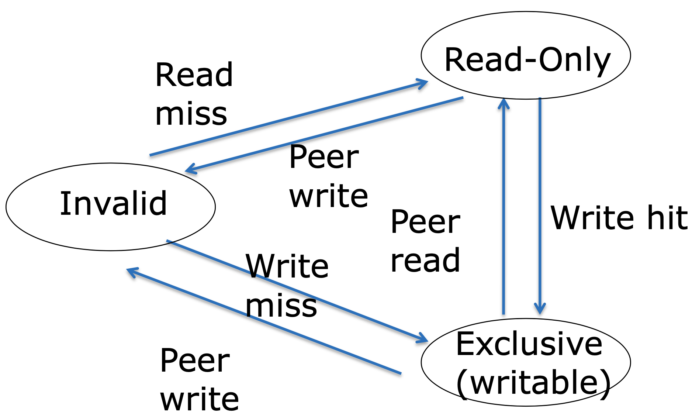

# Cache Coherence

Coherence는 system이 마치 단 하나의 data copy가 있는 것처럼 동작하는 것을 말한다.
즉, consistency 문제를 말한다.

Single core system에서는 write-back + dirty bit 등으로 cache와 main memory 사이의 consistency를 해결할 수 있었지만,
multicore system에서는 per-core cache들 사이에서도 consistency 문제가 존재한다.

## Cache State Machine

Rust의 reference system처럼 ownership 개념을 이용하여 각 cache block의 state를 관리한다.
각 per-core cache가 main memory page에 대한 reference라고 생각하면 이해하기 편하다.
