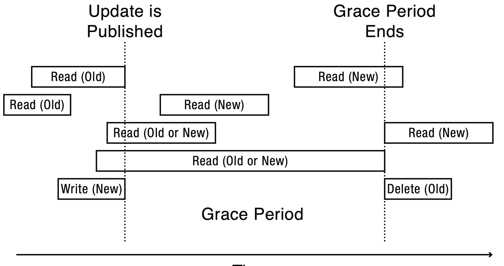

# Read-Copy-Update

Even RwLock needs to update the state **in synchronization variable**,
which undergoes the same performance issue: lock contention.

## Read-Copy-Update Overview

* Goal: very fast read
* Restricted update
  * Writer computes a new version
  * Publish the new version with single atomic write
  * Readers may see old or new version
* Integrated with scheduler
* Grace Period
  * When all readers lose the reference to old version, then gc.

