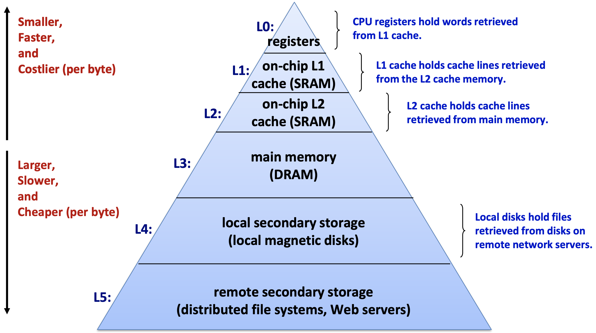

# Memory Hierarchy

메모리는 device 및 성능 등에 따라 hierarchy를 이루며 성능을 극대화시킨다.

## Memory Device

Memory techonology에 따라 성능, 가격 등에서 차이가 존재.
일반적으로 성능과 가격 사이에 trade-off가 존재.

|Technology|Access Time|$/GiB|
|:-:|:-:|:-:|
|SRAM|0.5 ~ 2.5ns|$500 ~ $1000|
|DRAM|50 ~ 70ns|$10 ~ $20|
|Flash(SSD)|5µs ~ 50µs|$0.75 ~ $1.00|
|Disk|5ms ~ 20ms|$0.05 ~ $0.10|

### Static RAM (SRAM)

* 한 cell은 4개 또는 6개의 transistor로 구성됨.
* 휘발성, 반영구적: 전원이 공급되는 동안에만 영구적으로 지속됨

### Dynamic RAM (DRAM)

* 한 cell은 1개 capacitor(bit) + 1개 transistor(access)로 구성됨
* 휘발성, 비영구적: 전원이 공급되는 동안에만 지속되며, 주기적으로 capacitor를 refresh 해주어야 함

### Flash Drive / Solid State Drive (SSD)

* 전자 터널링을 이용하여 절연체에 둘러쌓여 있는 floating gate transistor를 charge/discharge
* 비휘발성: 전원 공급 없이도 지속됨

### Disk

* 자기를 띤 원형 disk와 access를 담당하는 회전 팔로 구성됨
* 비휘발성: 전원 공급 없이도 지속됨

## Locality

빠르고 성능 좋은 device는 용량이 작으니 자주 사용되는 데이터를 담아야 효과적임.
자주 사용되는 데이터는 어떤 데이터인가?

* Temporal Locality: Recently referenced items are likely to be accessed again soon (e.g., instructions in a loop, induction variables)
* Spatial Locality: Items near those accessed recently are likely to be accessed soon (e.g., sequential instruction access, array data)

즉, 자주 사용되는 데이터는 최근에 사용된 데이터 혹은 그와 인접한 데이터

## Memory Access

높은 level일 수록 더 적고, 더 자주 사용되는 data를 저장하고 있으니, data에 access하기 위해 높은 level부터 차례로 살펴본다.
* Temporal Locality: 해당 level에 존재하지 않는 data는 다음 level에서 access한 후 해당 level에 저장하여 temporal locality를 극대화한다.
* Spatial Locality: 데이터를 block이라는 큰 단위로 다룬다.

### Terminology

* Block(line): A unit size of data (may be multiple words)
* Hit: Data present in upper level
  * Hit Ratio = hits / accesses
* Miss: Data absent in upper level
  * Miss Penalty = Time taken to access lower level and copy the block
  * Miss Ratio = 1 - hit ratio
