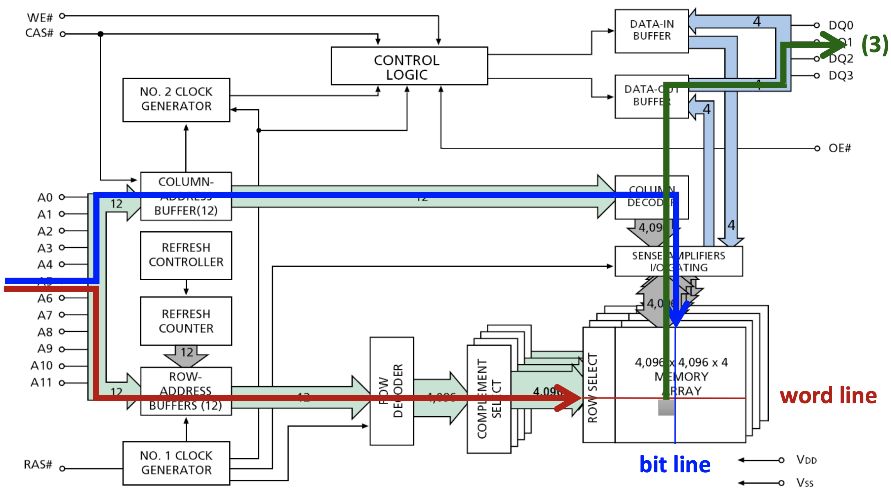

# Random Access Memory (RAM)

Random Access를 지원하는 memory device를 통틀어 RAM이라 부른다.

## Random Access

어느 위치에 있는 데이터에 접근하더라도 동일한 속도로 접근할 수 있음을 의미.
이와 반대대는 개념은 Sequential Access로, 인접한 데이터일수록 빠르게 접근할 수 있다.

## Dynamic RAM (DRAM)

데이터는 bank라고 불리는 2D array 구조에 저장되며, bank의 각 element는 전하로 bit를 나타내는 capacitor로 구성되어 있다.

데이터에 접근(read)은 word line을 통해 row를 select한 후 bit line을 통해 column을 select하여 한 bit를 load할 수 있게 된다. 이 때 여러 bank를 사용하면 각 bank으 동일한 row/column bit들을 병렬적으로 한 번에 load할 수 있어 bank 수는 memory bandwidth 직접적인 영향을 준다.
