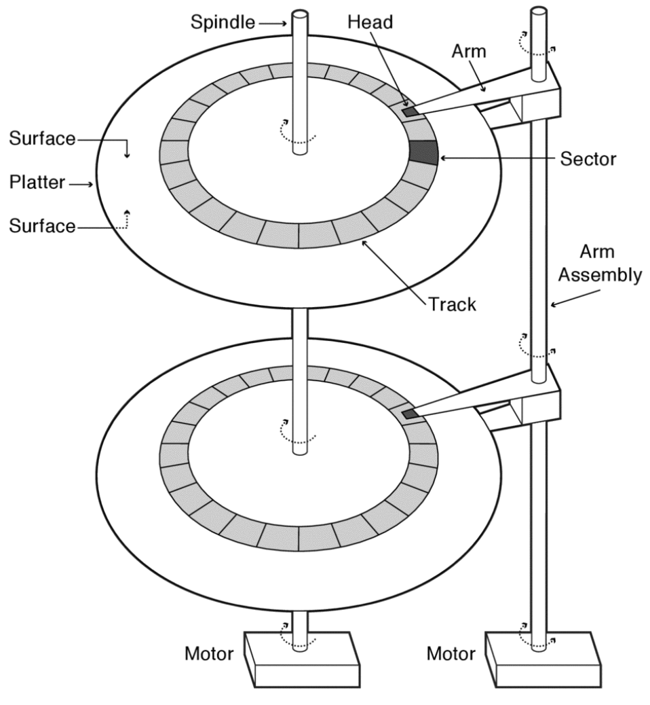

# Disk Drive

각 platter마다 양 면, 즉 두 surface를 가지고, 각 surface는 반지름이 다른 여러 track들로 이루어져 있다. 각 track은 반지름에 따라 서로 다른 수의 sector를 가지고 있으며 각 sector마다 데이터를 저장하고 있다.

Arm은 데이터에 접근하기 위한 수단이며 head가 가진 자성을 이용한다.
각 platter마다 arm이 있으며 모든 arm은 하나의 arm assembly에 연결되어 같이 움직인다.
따라서 한 번에 각 platter의 동일한 위치의 sector에서 데이터를 동시에 접근할 수 있다.

## Disk Performance

### Throughput vs. Latency

* Throughput: 한 번에 얼마나 많은 데이터를 읽거나 쓸 수 있는가 (bit/sec)
* Latency: 데이터를 한 번 읽거나 쓰는데 얼마나 시간이 걸리는가 (seconds)

### Disk Latency

Latency = Seek Time + Rotation Time + Transfer Time

* Seek Time = Disk Arm을 회전시켜서 목표한 track을 찾는 시간
* Rotation Time = Platter를 회전시켜서 목표한 sector가 disk head에 닿는 시간
* Transfer Time = Data가 sector로부터/sector로 이동하는 시간 (sector to buffer)
  * Host transfer time (buffer to host)와는 다르다.

### Random Access vs. Sequential Access

Sequential access가 더 빠른데, 그 이유는 random access는 각 access마다 seek time, rotation time이 들어가지만 sequential access는 맨 첫 번째 access에만 들어간다.

## Disk Scheduling

여러 개의 disk access request를 어떤 순서로 처리할 것인가?

### FIFO

들어오는 순서대로 처리하는 방법. 가장 단순하지만 가장 성능이 나쁘다.

### SSTF (Shortest Seek Time First) / SPTF (Shortest Positioning Time First)

언제나 가장 빠르게 처리할 수 있는 request부터 처리하는 greedy algorithm.
하지만 Suboptimal & Starvation Susceptible.

## Elevator

엘리베이터가 층에 멈추는 것처럼 disk arm이 안에서 밖으로, 또는 밖에서 안으로 이동하면서 처리 가능한 request들을 처리하는 방식. 상대적으로 fairness가 보장되는 장점이 있다. SCAN, CSCAN, R-SCAN, R-CSCAN이 있다.
