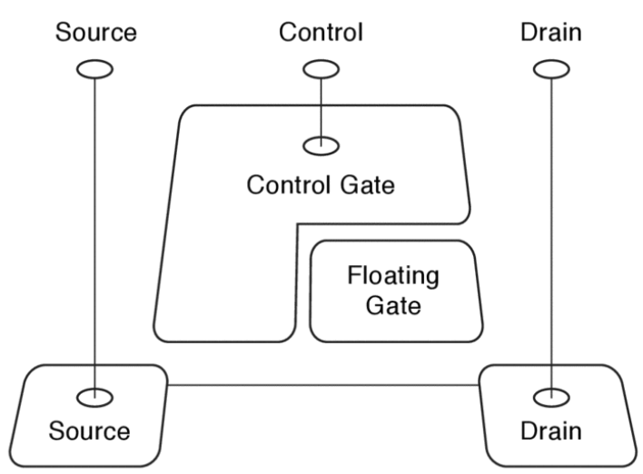

# Flash Drive

움직이는 부분이 없어 disk에 비해 물리적 충격에 강하며, 더 나은 random I/O performance를 보여준다. Solid State Drive라고도 한다.

## Flash Drive Organization

Flash drive의 각 element는 floating gate transistor이다.
위 그림에서처럼 floating gate가 아무 회로에도 연결되어 있지 않으며, 절연체로 둘러쌓여 있다.
그렇기 때문에 전력 공급 없이도 전하를 영구히 보존할 수 있다.
또한 주위에 고압 전류를 흘려 electron tunneling으로 floating gate를 charge 또는 discharge 시킬 수 있다.
한편, floating gate의 charge state는 transistor의 activation threshold에 영향을 미친다.
이를 이용하여 적당한 전압의 전류를 흘려주어 floating gate의 charge state를 알아낼 수 있다.

## NAND Flash Drive Operation

NAND flash drive는 page 단위($\approx$ 4KB)로 데이터를 다룬다.
따라서 NAND flash에서 일어나는 operation은 다음 3가지이다.

* Read page: 한 page를 read => read time
* Write page: 한 page에 write => write time
* Erase erasure block: 한 **erasure block**을 초기화 => flash time

당연하지만 한번 charge된 floating gate는 전하량이 영구히 보존되므로 write operation을 수행하기 위해서 초기화해주는 작업이 필요하다.
이 작업이 마치 카메라의 flash와 비슷하여 SSD에 flash라는 이름이 붙게 되었다.
해당 작업($\approx$ ms)은 read/write operation($\approx$ µs)에 비해 매우 느리기 때문에 flash는 erasure block이라는 훨씬 큰 단위로 초기화한다.

이는 한 page를 write하더라도 한 erasure block 전체를 초기화해야 하기 때문에 초기화하기 전 먼저 block 내 다른 page들을 읽고 나서 초기화 후 다시 write해주어야 한다.
따라서 (block size / page size - 1) 만큼의 page를 추가로 read, write해야 한다.

* 1 page write performance = $t_{flash} + (b_{block} / b_{page} - 1) * (t_{read} + t_{write}) + t_{write}$

### Flash Translation Layer (FTL)

Flash에서는 이러한 성능 문제를 해결하기 위해 Flash Translation Layer(FTL)을 이용하여 virtual memory처럼 logical page와 physical location을 mapping하여 사용한다.
Flash는 항상 적어도 하나의 unused erasure block을 가지도록 설계되어 있는데, write operation에서 새 page를 unused erasure block에 write한 후 mapping을 변경한다.

이렇게 하더라도 기존 page가 속한 erasure block의 다른 live page들을 새 erasure block으로 복사(= read + write)한 후 기존 erasure block을 초기화하는 additional cost가 존재한다.

* 1 page write performance = $t_{flash} + (b_{erasure} / b_{page} - 1) * (t_{read} + t_{write}) + t_{read}$

이 cost까지 고려하면 FTL을 사용할 때 얻는 performance 향상이 없다.
그러나 여러 page를 write할 경우에도 한 번의 초기화만 이루어지기 때문에 여기서 성능 향상이 있다.

* n page write performance = $t_{flash} + (b_{erasure} / b_{page} - n) * (t_{read} + t_{write}) + n * t_{read}$
