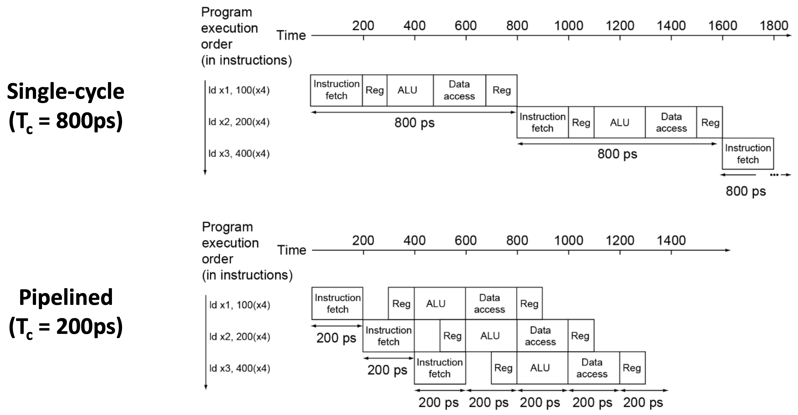

# CPU Pipeline

## Parallelism

동시에 여러 일을 수행하는 것

* Multicore를 통한 True parallelism
* Threading을 통한 Concurrency

## Pipelining

하나의 hardware instruction을 수행하기 위해서 여러 작업이 필요한데,
각 작업은 서로 의존관계가 존재한다.
예를 들어, ALU에서 연산(Execution)하기 위해서는 먼저 instruction을 decode하고 register file에서 값을 읽어와야(Decode) 한다.

문제는 Decode하는 동안 ALU가 놀고, Execution동안 Register File이 논다.
따라서 Decoder가 한 instruction을 decode하여 ALU에 넘겨주면 ALU가 연산을 수행하는 동안 Decoder는 다음 instruction을 decode한다면 더 빠른 execution이 가능하다.

이처럼 instruction execution을 여러 stage로 나눠서 각 stage를 overlapping 시켜서 분업하는 기술을 pipelining이라고 한다.

## Comparison (vs. No Pipelining)

Example: 5 stage

* 한 instruction을 수행하는 데 걸리는 시간: 약간의 overhead (inter-stage overhead)
* 한 instruction을 수행하는 데 필요한 clock cycle: 5배 (5 stage => 5 cycle)
* CPS (Cycle Per Second)
  * best: 5배 (all stage equal)
  * worst: ~= 1 (한 stage가 execution time의 대부분을 차지)
* MIPS(Million Instructions Per Second): CPS배 (Pipelining을 통해 한 cycle마다 하나의 instruction이 완료됨)

### Summary

* Pipelining doesn’t help latency of single task,
it helps throughput of entire workload
* Multiple tasks operating simultaneously using different resources
* Potential speedup = Number pipeline stages
* Pipeline rate limited by slowest pipeline stage
* Unbalanced lengths of pipe stages reduces speedup
* Time to fill pipeline and time to drain it reduces speedup
* Stall for Dependences
