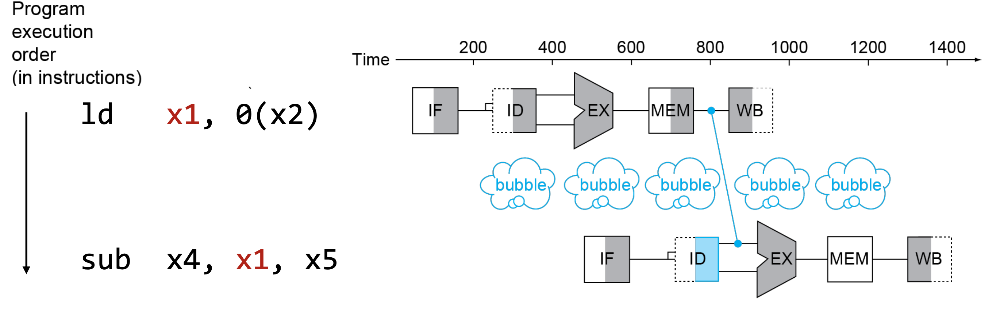

# Structural Hazard

Conflict for use of a resource

## Solution

* Stall
* Resource Duplication

## Example

* Load/Store requires data access.
* Instruction Fetch would have to **stall**
* Cause pipeline bubble
* Solution:
  * Separate Instruction/Data Memory
  * Multiple Read Ports

# Data Hazard

An instruction depends on completion of data access by a previous instruction

## Example: Read-After-Write (RAW)

Reading value from register before previous instruction writes the result

## Solution

* Freezing (Stall)
* Data Forwarding
* Compiler Scheduling Optimization
* Out-of-order Execution

## How to Stall

* Prevent Update of PC
* Force control values in ID/EX register (stores result) to 0 => MEM/WB do nop

## Data Forwarding

Value가 write되기를 기다리지 말고 각 hardware unit에서 연산 결과를 바로 forwarding해서 사용

### Load-Use Data Hazard

이전 instruction이 Load인 경우 execution stage에서 계산 되는 것이 아니라,
그 다음 stage인 memory stage에서 value를 가져오기 때문에,
forwarding을 한다고 해도 stall을 피할 수 없다.

## Compiler Scheduling Optimization

Reorder code to avoid use of load result in the next instruction

# Control hazard

Branch instruction에서 next instruction이 달라질 수 있음

## Solution

* Stall
* Branch Prediction
* Compiler Scheduling Optimization

## Branch Prediction

Predict next branch. If wrong, cancel (flush the pipeline).

### Branch Prediction Buffer

Buffer the prediction result. Update the prediction on actual result.

* 1-bit => Double miss on nested loop
* 2-bit prediction => (Strong/Weak) (Taken/Not-Taken)

### Branch Target Buffer

Even with predictor, still needs to calculate target.
Buffer the target address => indexed by PC
