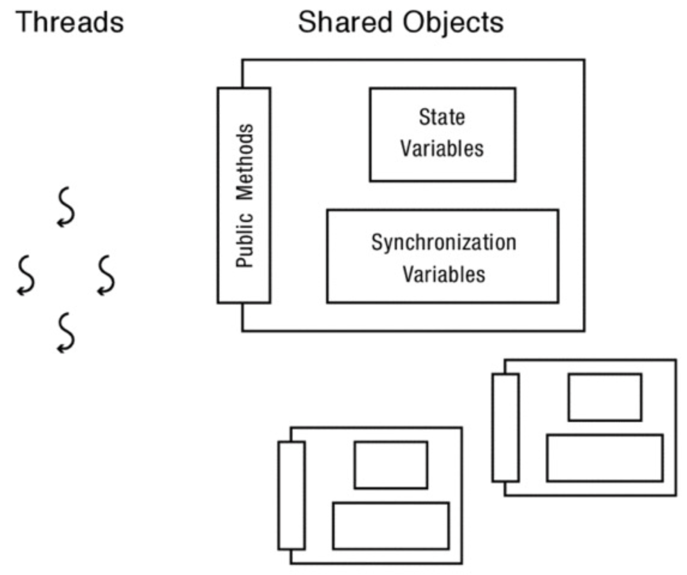

# Shared Objects

If a program has independent threads that operate on completely separate subsets of memory, we can reason about each thread separately.

But, most multi-threaded programs have both per-thread state and shared state.
Cooperating threads read and write shared state
=> Writing correct multi-threaded programs becomes much more difficult.

## Race Condition

Output of a concurrent program depends on the order of operations between threads

This is very bad:
- Non-deterministic don’t know what the output will be, and it is likely to be different across runs
- Hard to detect: too many possible schedules
- Hard to debug: “heisenbug,” debugging changes timing so hides bugs (vs “bohr bug”)

## Example

What would be the result of x?

```c
// Thread 1
x = 1;
// Thread 2
x = 2;
```

The result can be either 1 or 2; we don't until execution!

## Shared Object Structure


