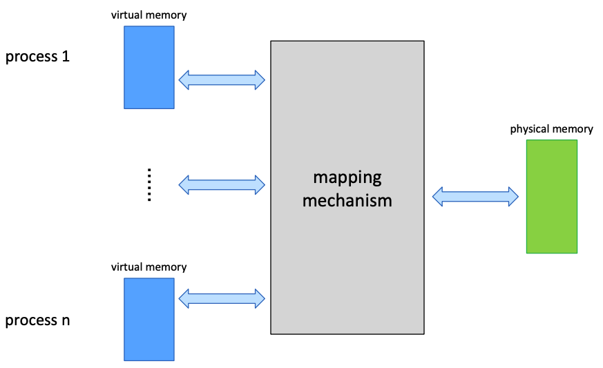

# Virtual Memory Concept

한 번에 한 process만 존재한다면 고민할 게 없다.
그러나 여러 process가 존재하면서 여러 가지 문제가 생긴다.

* Sparsity: Process model에서 이론적으로 process의 수는 무한하다. 그러나 메모리 자원은 한정적이므로 모든 process에 메모리를 할당하기는 어렵다.
* Isolation: 각 process는 할당받은 memory에 대한 베타적 소유권을 가진다. 즉, 다른 process의 메모리에 접근할 수 없어야 한다.
* Sharing: 그러나 동시에 shared memory 등에는 여러 process가 동시에 접근할 수 있어야 한다.

## Level of Indirection

이런 문제를 해결하기 위해 등장한 virtual memory는 level-of-indirection이다.
각 process마다 private virtual memory space(32bit/64bit)을 가지고,
각 process의 virtual memory들을 physical memory에 mapping한다.

## Memory Management Unit

MMU는 virtual memory를 physical memory로 변환해주는 하드웨어 부품이다.

## Address Space

Address space는 메모리 주소의 집합으로, 보통 주어진 수의 bit(32/64)로 나타낼 수 있는 메모리 주소들, 즉 $[0, 2^N)$이다.
Memory type에 따라 virtual / physical address space로 구분지을 수 있다.

모든 process는 각자의 고유한 virtual address space를 가지며, 서로 disjoint하다.
즉, 같은 address여도 가리키는 메모리가 다르다.

각 process의 virtual address space에 대한 mapping은 context switching할 때 함께 바뀐다.
x86의 경우 cr3 register가 mapping table의 (물리적) 주소를 가리킨다.

## Physical Memory layout

각 physical memory layout은 제품마다 다르며, 내장된 firmware가 start time에 kernel에 해당 정보를 넘긴다.

## Canonical Hole

Address space가 클 때의 단점은 mapping table 및 translation 비용의 증가이다.
현대의 64bit 운영체제의 virtual memory system은 64bit 중 48bit만 사용하며,
16bit는 sign extension이다. (0x0000000000000000 ~ 0x00007FFFFFFFFFFF, 0xFFFF800000000000 ~ 0xFFFFFFFFFFFFFFFF)
따라서 가운데 큰 공백이 생기는데, 이를 canonical hole이라고 한다.
