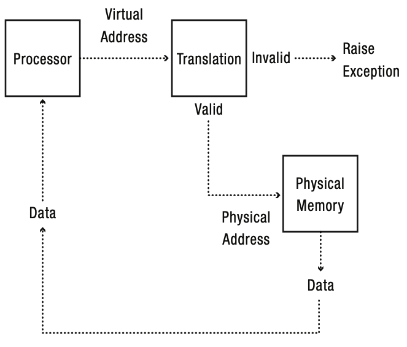
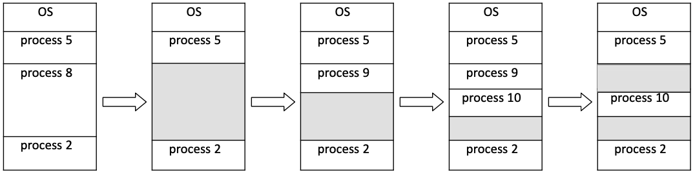
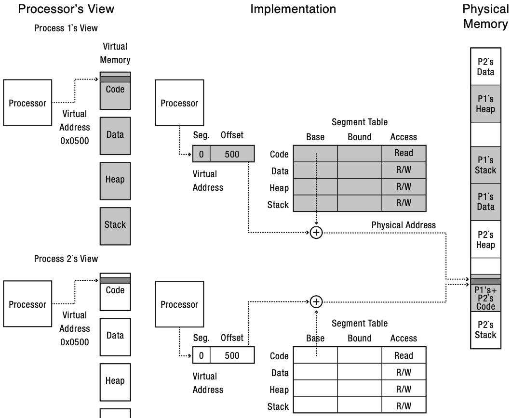
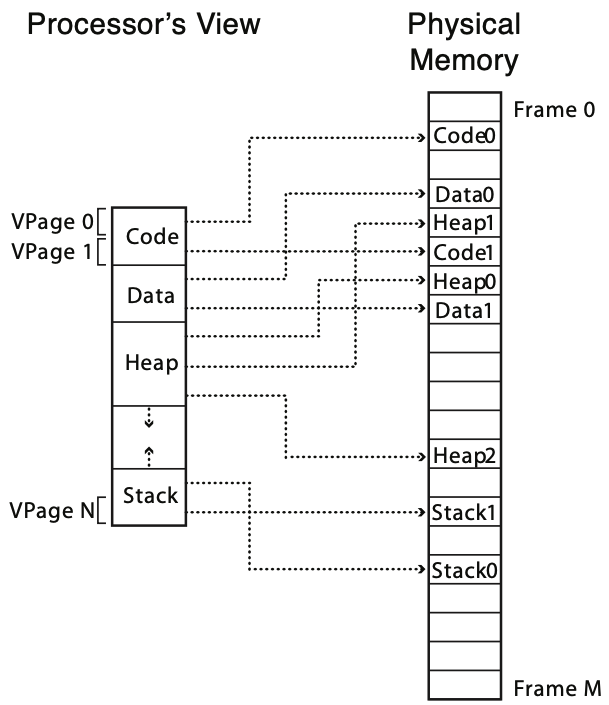

# Address Translation

MMU가 virtual address를 physical address로 변환하는 과정.

Address translation은 다음과 같은 목표를 가진다.

* Protection - memory에 대한 invalid access를 막아야 한다.
* Sharing - process간 memory를 공유할 수 있어야 한다.
* Sparsity - address space의 sparse한 특성을 잘 활용한다.
* Efficiency - resource overhead 및 waste를 줄이고, translation을 효율적으로 한다.

## Contiguous Allocation

각 process에 memory resource를 할당할 때 contiguous allocation은 여러 문제를 가진다.

### Dynamic Memory Size

Address Space를 전부 할당하는 것은 엄청난 resource 낭비이다.
그렇다고 실사용량만큼 할당하려고 하니 동적인게 문제다.

* 너무 조금 할당하면 메모리 사용량 증가에 따른 잦은 reallocation이 발생
* 너무 많이 할당하면 메모리 낭비

### Free Management

각 memory slot이 사용중인지 알기 위해 발생하는 metadata의 크기가 너무 크다 (1byte당 1bit)

### Fragmentation

각 process에 physical memory를 할당할 때 contiguous allocation은 fragmentation을 발생시킨다.

## Segmentation

Segment is a contiguous region of *virtual* memory,
which can be located anywhere in physical memory.

* Virtual Address = \[segment-number, offset\]
* Segment Table = (start address, length, access permission)

그러나 segmentation 방법도 fragmentation에서 자유로울 순 없다.
왜냐하면 결국 segment의 길이가 동적이기 때문이다.

## Copy On Write

Process를 fork할 때 virtual address가 동일한 memory region을 가리키도록 하고,
segment에 write할 때 copy하는 방법.

## Paging

Segment 대신 **page**라는 고정 길이 단위로 메모리를 분할하여, page 단위로 메모리를 관리.
참고로 physical page는 frame이라고도 부른다.

즉, 고정 길이 단위를 사용함으로서 fine-grained management로 fragementation을 없애고,
실사용량만큼 메모리를 할당하여 효율을 높이는 방법이다.
뿐만 아니라 free page를 tracking할 때 byte당 1bit가 아니라 page당 1bit라 overhead가 적다.
