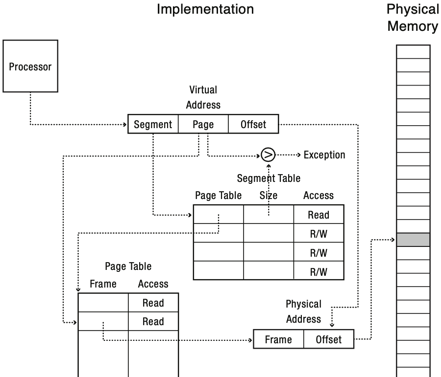
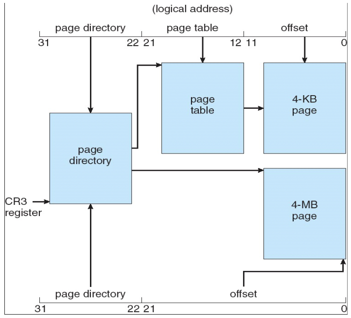

# Sparse Address Space

Page size가 4KB일 경우 32bit는 50만개, 64bit는 4000조개의 page table entry가 필요하다.
그러나 address space를 전부 사용하는 경우는 (거의) 없기 때문에 이 중 대부분은 invalid entry이다.
Sparse matrix처럼 sparse address space를 잘 handling하는 방법이 필요하다.

## Paged Segmentation

Page table size가 문제가 되는 이유는 sparse address space를 전부 mapping해야 하기 때문이다.
그러나 variable-size segment를 fixed-size page로 관리하면 sparse address space 대부분을 segment table로 걸러낼 수 있다.
각 segment는 실사용 memory만을 paging하면 된다.

## Multi-Level Paging

Page table의 tree를 만들어서 high-level page table(page directory)은 physical frame이 아닌 low-level page table을 mapping한다.
이렇게 하면 translation 과정은 여러 단계의 page table lookup을 거치게 된다.

또한, mapping을 위해 한 page table이 한 physical frame에 들어가야 하기 때문에 page table size가 page size로 고정된다.

예를 들어, 32bit AS, 4KB page(& page table), 4byte PTE이면 two-level paging으로 딱 떨어진다.
* page offset = 12bit
* 4KB page table => 4KB / 4B = 1024 PTE => 10bit
* 32bit = 10bit(1st-level PN) + 10bit(2nd-level PN) + 12bit(offset)

64bit AS는 4KB page(& page table), 8byte PTE로 four-level paging을 사용하며,
64bit 중 48bit만 사용한다.
* page offset = 12bit
* 4KB page table => 4KB / 8B = 512 PTE => 9bit
* 64bit = 16bit(unused) + 9bit(L1) + 9bit(L2) + 9bit(L3) + 9bit(L4) + 12bit(offset)

이 방법의 장점은 valid entry가 없는 table은 table 자체를 없애고 page directory에 invalid로 mark할 수 있어 유효한 entry만 할당이 가능하다는 점이다.

이 방법의 단점은 indirection level이 늘어남에 따라 resource overhead가 증가한다는 점이다.

### Superpage

만약 연속한 page들이 모두 valid entry들을 가리키고 있어서,
한 page table의 (거의) 모든 entry가 valid하다면,
이 frame들을 모두 합쳐 superpage로 만들고 page directory가 superpage를 직접 가리키게 해서 overhead를 줄일 수도 있다.

## Example: x86-64 i7 Core

x86 architecture는 위 두 방법을 모두 이용(multilevel-paged segmentation)한다.
Segment table에 해당하는 Global Descriptor Table이 각 segment에 대한 정보를 가지고 있고,
각 segment는 위에서처럼 2-level(32bit) 또는 4-level(64bit)로 paging된다.
