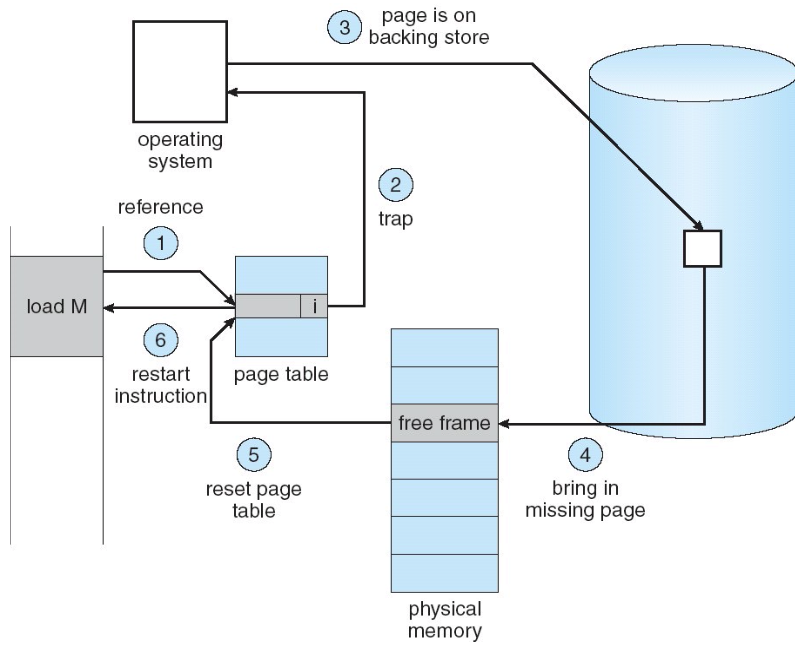

# Demand Paging

Demand Paging은 Fill on Demand처럼 필요할 때 (page fault) disk에서 memory로 올리는 방법이다.
Demand paging을 이용하면 physical memory를 disk block에 대한 cache로 사용해서 disk만큼 큰 memory 혹은 memory만큼 빠른 disk 효과를 볼 수 있다.

## Memory-Mapped File

Memory-mapped file은 memory만큼 빠른 disk이다.
Memory를 disk에 대한 cache로 활용해서 일반적인 File I/O와 달리 memory에 대한 load/store를 수행한다.
수정된 physical frame은 wipe out될 때 disk write를 수행한다 (write back).

## Infinite-Sized Memory

Demand paging은 virtual memory가 physical memory보다 클 수 있게 해준다.
즉, disk만큼 큰 memory이다.
Locality를 이용해서 전체 data 중 일부만 physical memory에 올리고 나머지는 disk에 보관한다.
Page table은 physical frame에 없는 data는 disk block에 대한 포인터를 저장한다.

Page fault가 발생했을 때 만약 disk에 있는 data라면 page fault handler는 기존 physical frame 중 하나를 swap한 후 instruction을 restart한다.

## Page Replacement: Clock Algorithm

Cache replacement처럼 page replacement도 victim page를 고르는 policy가 필요하다.
LRU를 사용하면 좋은데 LRU는 cost가 비싸서, LRU에 대한 approximation인 clock algorithm을 사용한다.

Page별로 reference bit을 저장하고, reference되면 set한다.
한편, clock(circular list of pages)에서 다음과 같은 과정을 거쳐 victim page를 고른다.
* Clock hand(pointer)가 가리키는 page의 ref bit을 확인한다.
* Unset이면 victim으로 선택
* Set이면 unset하고 다음 page로 pointer를 advance시킨다.

한편, dirty page는 교체시 disk write가 발생해서 더 비싸기 때문에 dirty bit을 함께 활용하여 clean page만 victim으로 선택하는 extension이 있다.
만약 victim을 못 찾았다면 unreferenced dirty page들을 flush하고 다시 victim을 찾는다.

## Thrashing

Demand paging이 효과를 볼 수 있는 이유는 locality 때문이다. 그러나 working set이 physical memory보다 큰 경우 frame swap이 계속, 그리고 자주 발생하여 오히려 성능 문제를 일으킬 수 있다.
이를 thrashing이라고 한다.
