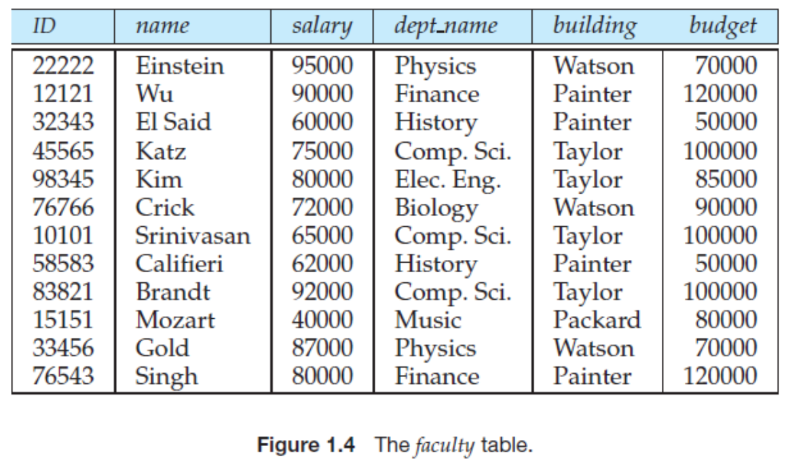

# Introduction to Database

## What is a database?

* Data
  * formal description of
  * an entity, event, phenomena, or idea
  * that is worth recording
* Database
  * integrated collection of
  * **persistent data** (data that is stored on persistent storage)
  * representing information of interest
* DBMS: An abstraction for a set of programs that manage data

## Drawbacks of File Systems

* Data **redundancy** (중복) & **inconsistency** (불일치)
  * Duplicate of data in multiple files (redundancy)
  * 중복 data간 sync 문제 (inconsistency)
* Difficult to **access** data
  * Need to write a program to access data everytime
* Difficult to handle **integrity constraints**(무결성 제약)
  * Set of conditions which data must ensure to be correct
  * Program에서 integrity control해줘야 함
* Data **atomicity**(원자성) problem
  * Query failure
  * Concurrent access
* **Security** problem

## Levels of Data Abstraction

Multiple levels of abstraction to reduce complexity of system

* **Physical level**  : *how/where a record is stored* in physical device
* **Logical level**   : *data structure and their relationship*
* **View level**      : *details of data type are hidden by application*

## Data Independence

Ability to modify a schema in one level without affecting next higher level.

* **Physical data independence**  : physical - logical indep. (*logical does not know physical*)
* **Logical data independence**   : logical - view indep. (*view hides logical schema*)

## Instance & Schema

* Scheme - **structure of database** ~= type
* Instance - **contents of database** ~= value
  * time dependent

## Data Model

* **Framework/formalism for representing data**
  * data
  * relationships
  * semantics
  * constraints
* ER model (data as entity and their relationships)
* Relational model (data in tabular form)
* Object-oriented model, etc.

## Database Language

* **DDL**: define schema
* **DML**: manipulate(CRUD) instance
* **Query**: statement for requesting the retrieval of information

## Database User & Administrator

* User: app programmer, end user of app, etc.
* **Administrator(DBA)**: database owner -> coordinates all the activities of database
  * Design
  * Performance
  * Access control

## Discussion

### 1-2. Physical Data Independence

Q. Explain the concept of physical data independence, and its importance in database systems.

A. Logical level에서 physical level에서 데이터를 어디에 어떻게 저장하는지 알 필요가 없다.

### 1-3. Data Redundancy

Q. Describe the information content represented by the table in Figure 1.4.

A. Building과 budget이 department에 dependent.

Q. Explain what problems may arise by this design.

A. Data inconsistency 문제

### 1-5. File Systems

Q. If the data in the previous problem were kept in a file system (without the use of a DBMS), describe a situation where things may go wrong.

A. When multiple processes access to the same file concurrently, atomicity is not guaranteed.

### 1-6. Keyword Query

Q. Keyword queries used in Web search are quite different from database queries.
List key differences between the two, in terms of the way the queries are specified, and in terms of what is the result of a query.

A. SQL query is deterministic while keyword query is fuzzy (sort by rank).
