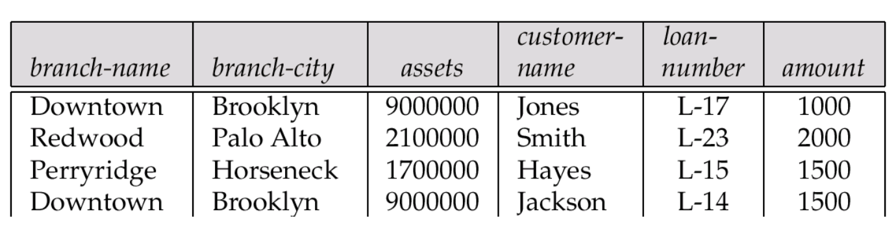

# Redundancy and Normalization

## Design Goal

* 속성들 간의 관계가 모두 표현됨
* 불필요한 데이터 중복을 피함
* Facilitate enforcement of database integrity constraints

### Anomaly

Data redundancy에 의해 발생하는 inconsistency/error => redundancy 없도록 decompose

* Insert anomaly: 새 데이터를 삽입하기 위해서 불필요한 데이터도 함께 삽입해야 하는 문제
* Deletion anomaly: 튜플 삭제시 다른 필요한 정보까지 삭제되는 문제
* Update anomaly: 중복 데이터 중 일부만 변경하여 consistency가 깨지는 문제

## First Normal Form (1NF)

All attribute domains are atomic.

만약 atomic하지 않은 attribute가 있다면 여러 개의 atomic한 attribute로 분해.

## Functional Dependency

For any legal relation $r(R)$, $\alpha \rightarrow \beta$ iff $\forall t_1, t_2 \in r, t_{1}[\alpha] = t_{2}[\alpha] \rightarrow t_{1}[\beta] = t_{2}[\beta]$.

$\alpha$ is a **determinant** of $\beta$ or $\beta$ is **dependent** to $\alpha$.

**Legal relation** is a relation that complies every integrity constraint.

### Definition of Keys

* Superkey $K$
  * $K \rightarrow R$
* Candidate key $K$
  * $K \rightarrow R$
  * $^\forall \alpha \subset K$, $\neg (\alpha \rightarrow R)$

### Trivial FD

Satisfied by all relation $r(R)$.
$\alpha \rightarrow \beta$ is **trivial** iff $\beta \subseteq \alpha$.

### Partial/Full FD

$X \rightarrow Y$ is partial FD iff $^\exists \alpha \subset X, \alpha \rightarrow Y$. Otherwise, $X \rightarrow Y$ is full FD.

### Transitive FD

$X \rightarrow Z$ is transitive FD iff $^\exists Y, (X \rightarrow Y) \land (Y \rightarrow Z)$.

## Closure

The set of all functional dependencies logically implied by $F$ is the **closure** of $F$ (denoted $F^+$).

### Armstrong's Axiom

* reflexivity: $\beta \subseteq \alpha \Rightarrow \alpha \rightarrow \beta$
* augmentation: $\alpha \rightarrow \beta \Rightarrow \gamma \alpha \rightarrow \gamma \beta$
* transitivity: $(\alpha \rightarrow \beta) \land (\beta \rightarrow \gamma) \Rightarrow \alpha \rightarrow \gamma$

Armstrong's axiom is sound and complete.

## Second Normal Form (2NF)

All attributes are fullly dependent to candidate key.

candidate key의 부분집합이 중복되면 이 부분집합에 종속인 attribute는 당연히 중복된다.

해당 attribute를 추출하여 이 부분집합과 함께 별도의 relation으로 decompose.

## Third Normal Form (3NF)

2NF + all attributes are not transitively dependent to candidate key.

2NF이더라도 candidate key가 아닌 attribute set에 종속인 attribute가 있을 수 있다.
이 때 candidate key → attribute set → attribute이므로 transitively dependent.
이 attribute set이 중복되면 attribute 또한 중복된다.

## Boyce-Codd Normal Form (BCNF)

All determinants of FDs are superkey unless it is trivial.

Any relation is in 3NF if it is in BCNF.

* 2NF를 위배하는 FD가 있으면 해당 FD의 determinant는 superkey일 수 없으므로 BCNF를 위배
* 3NF를 위배하는 FD가 있으면 $Y$에 해당하는 FD는 superkey일 수 없으므로 BCNF를 위배

만약 BCNF를 위배하는 FD $X \rightarrow Y$가 있으면 Y만 따로 추출하여 별도의 relation으로 decompose.

## Decomposition

$\{R_1, \ldots, R_n\}$ is a decomposition of $R$ iff $R = \cup_{i=1}^{n}R_i$.

### Lossless-Join Decomposition

For any legal relation, decomposed relation을 join했을 때 원래 relation과 같아짐.

$\{R_1, R_2\}$ is a lossless decomposition if $(R_1 \cup R_2) \rightarrow R_1$ or $(R_1 \cup R_2) \rightarrow R_2$.

예를 들어, 한 relation이 다른 relation의 key를 attribute를 가지는 경우.

## Dependency Preservation

Decompose시 각 relation의 FD의 union의 closure가 원래 relation의 FD closure와 같음

BCNF decomposition은 dependency를 preserve하지 못할 수도 있다.

## Closure of Attribute Sets

For any closure of $\alpha$ under $F$ (denoted $\alpha^+$),
$\beta \subseteq \alpha^+ \iff \alpha \rightarrow \beta \in F^+$.

closure = $\alpha$가 determinant인 가장 큰 attribute set.

알고리즘: $\alpha$에서 시작해서 repeat until no change

* $\forall \beta \rightarrow \gamma \in F$
* if $\beta \subseteq$ result, result $\rightarrow$ result $\cup \gamma$

사용처

1. FD test: $\beta \subseteq \alpha^+ \iff \alpha \rightarrow \beta$
2. superkey test: $R = \alpha^+ \iff R \subseteq \alpha^+ \iff \alpha \rightarrow R$
3. compute $F^+$: $^\forall \gamma \subseteq R$, $\gamma \rightarrow S$ iff $S \subseteq \gamma^+$. $\gamma \rightarrow \gamma^+$라 자명

## BCNF Test

* $\alpha \rightarrow \beta$ test = superkey test
* single relation test: test only $F$ rather than $F^+$ (증명 가능)
* 만약 decomposition이라면 dependency preservation이 안 될 수도 있어서 $F^+$ test
  * BCNF decomposition할 때 처음 F^+를 기억해야 하는 이유

## Denormalization

Peformance 때문에 normalize 안할 수도 있음 / 혹은 **view** 사용

* faster lookup
* extra space & extra execution time for updates
* extra code work & extra possibility of error

## Exercise

### Redundancy & Anomaly

* Redundancy: loan마다 branch 정보 (name, city, asset)이 중복됨
* Insert anomaly: loan이 없는 branch는 삽입할 수 없음
* Update anomaly: 한 튜플만 branch 정보를 바꾸면 consistency 깨짐
* Delete anomaly: L-17, L-14 삭제하면 Downtown branch 정보 사라짐

### Armstrong

$R = (A, B, C, G, H, I)$, $F = \{A \rightarrow B, A \rightarrow C, CG \rightarrow H, CG \rightarrow I, B \rightarrow H\}$

$F^+ = \{A \rightarrow ABCH, B \rightarrow BH, CG \rightarrow HI\}^+$

### BCNF

Lending-schema = (b-name, b-city, assets, c-name, loan#, amount)
F = { b-name → b-city assets ; loan# → amount b-name }, Key = {c-name, loan#}

Branch = {b-name, b-city, assets} F = {b-name → b-city assets}
Loan = {loan#, amount, b-name} F = {loan# → amount b-name}
CustLoan = {c-name, loan#}

## Discussion

### 7-1. Functional Dependency

Q. List all meaningful* FDs for the following relation schema Student.

Student(ID, Name, Address, Age, Dept, Dept_office, Dept_Chair, College, AdvisorID, AdvName, AdvDept)

A. ID → Name Address Age Dept AdvisorID ; Dept → Dept_office, Dept_Chair, College ; AdvisorID → AdvName AdvDept

### 7-2. BCNF

Q. Is the schema in BCNF? If not decompose the relation into a set of relation schemas, each of which is in BCNF.

A. Student (ID, Name, Address, Age, Dept, AdvisorID)
Department (Dept, Dept_office, Dept_Chair)
Advisor (AdvisorID, AdvName, AdvDept)

### 7-3. Functional Dependency

Q. Explain how functional dependencies can be used to indicate the following:

* a 1-to-1 relationship exists between students and advisors
* a many-to-1 relationship exists between students and advisors

A. 1-to-1 => {ID → AdvisorID, AdvisorID → ID}
many-to-1 => {ID → AdvisorID}

### 7-4. BCNF

Q. Consider the following set of FDs on the relation schema r(A, B, C, D): A → BC, C → D. Give a BCNF decomposition of r.

A. R1 = (A, B, C), R2 = (C, D)

### 7-5. Lossless-Join Decomposition

Consider the following set F of FDs on the relation student(name, dept, college): F = {name → dept , dept → college}

Suppose student is decomposed into two relations stud1(name, dept) & stud2(name, college).

Q. Is this a lossless-join decomposition?

A. Yes

Q. Are relations stud1 and stud2 in BCNF?

A. Yes

Q. Is this a good decomposition?

A. No. It doesn't preserve dependency dept → college.

### 7-6. Closure

Q. Consider the following set F of FDs on the relation R = (A, B, C, D).
Compute F+.

F={ A → B; A → C; BC → D; DC → B}

A. A → R ; BC → BCD ; CD → BCD
(trivial, reflexive + transitive 제외하고)

### 7-8. BCNF

Q. Show that if none of the dependencies in F causes a violation of BCNF for R, then none of the dependencies in F+ will cause a violation of BCNF either.

A. Armstrong으로 F에서 F+로 확장할 때 처음으로 나오는 violation을 생각해보자.

* reflexivity로 유도된거면 trivial => non-violation
* augmentation으로 유도된거면 determinant의 subset이 superkey => 모순
* transitivity로 유도된거면 transitive closure라서 determinant가 superkey => 모순
