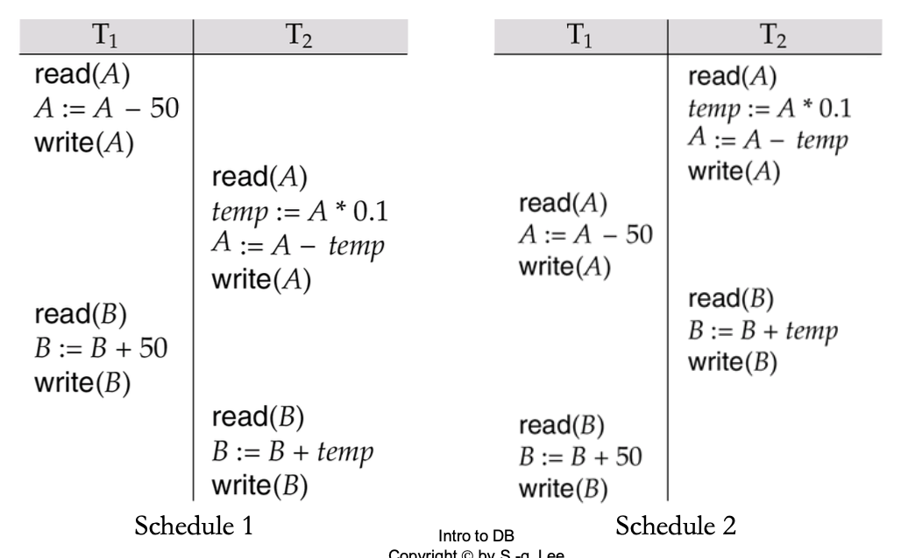

# Transactions

* User view: logical unit of work
* System view: program unit that read/write certain data item

## Properties of a Transaction

* Atomicity: all or nothing
* Consistency: move from consistent state to another consistent state
* Isolation: should not be interfered by other transaction
* Durability: effect of completed transaction should be durable & public

## Transaction State

* Active: initial state, stays while executing
* Partially Committed: the final statement has been executed
* Failed: normal execution can no longer proceed
* Aborted: rolled back, database restored to state before start tx.
* Committed: after successful completion

## Schedules

* Sequences of instructions that indicate chronological order of execution
  * Simplified view of transaction => ignore other than read & write
  * must consist of all instructions of those transactions
  * must preserve the order in which the instructions appear in each individual transaction

### Serial Schedule

* Each transaction does not interleave other transactions
* No concurrency

## Serializable Schedule

Equivalent to some serial schedule

### Equivalent Schedule

두 schedule은 모든 possible db instance에 대하여 실행 후 state가 같으면 equivalent하다

## Conflict Serializability

* 같은 item에 access하는 두 instruction이 conflict하는 것은 둘 중 적어도 하나가 write일 때
* 즉, 두 instruction간 순서가 바뀌면 실행 결과가 달라지면 conflict
* Conflict Equivalent: non-conflicting instruction들 간 순서를 바꿔서 다른 schedule로 만들 수 있음
* Serial schedule에 conflict equivalent하면 conflict serializable

## Precedence Graph

* Arc from earlier to later
* Cycle 없으면 conflict serializable
* Serializability order = topological sort

## Recoverable Schedule

* RAW, then CAC
* schedule은 반드시 recoverable해야 한다

## Cascading Rollback

한 transaction이 fail했을 때 다른 transaction rollback으로 이어지는 경우
그 transaction이 write한 데이터를 읽은 transaction은 모두 rollback됨

## Cascadeless Schedule

다른 transaction이 쓴 data를 읽는 경우 그 transaction이 commit된 후에 읽으면 cascadeless

## Discussion

### 17-4. Concurrency

Q. Justify the following statement: Concurrent execution of transactions is ...

* more important when data must be fetched from (slow) disk or when transactions are long
* less important when data are in memory and transactions are short

A. transaction이 오래 걸리면 그 동안 다른 일을 못하기 때문에 concurrent execution이 중요하고, 짧으면 금방 끝나고 다른 일을 할 수 있으므로 concurrency가 덜 중요하다.

### 17-5. Serial Schedule

Q. What are the values of A and B after the execution schedules 1 and 2? A=B=100, initially.

A. Schedule 1: A = 45, B = 135 ; Schedule 2: A = 40 ; B = 160

Q. The two schedules are both serializable but yield different results. Is this a discrepancy?

A. No. transaction order는 out of DBMS control

### 17-9. Cascadeless Schedule

Q. Show that every cascadeless schedule is also recoverable.

A. write 하기 전에 commit하므로 당연히 T_i가 먼저 commit한다. 즉 recoverable.
