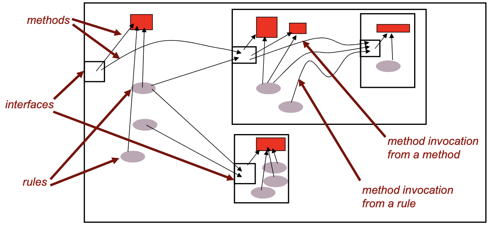

# Bluespec Overview

## Module

Bluespec에서 하드웨어를 기술하는 부분이 바로 module이다. OOP에서의 class를 생각하면 된다.
Module을 정의하는 것이 하나의 하드웨어 디자인을 정의하는 것이고,
이 module을 가지고 변수를 선언할 때 논리적 레벨에서 실제 하드웨어가 만들어진다.
Module의 내부 구조 또한 class와 매우 흡사하다.

```c
module mkGCD;
  // state
  Reg#(Int#(32)) x <- mkRegU; // not initialized
  Reg#(Int#(32)) y <- mkReg(0); // initialized to 0

  // internal behavior
  rule doSwap ((x > y) && (y != 0));
    x <= y;
    y <= x;
  endrule
  rule doStep ((x <= y) && (y != 0));
    y <= y - x;
  endrule

  // method
  method Action start(Int#(32) a, Int#(32) b) if (y == 0);
    x <= a;
    y <= b;
  endmethod
  method Int#(32) result() if (y == 0);
    return;
  endmethod
endmodule
```

Module은 state, internal behavior, method 등으로 이루어져 있다.


### Method

하드웨어의 내부 logic을 blackbox 처리한 채로 외부에서 하드웨어의 state를 변경시킬 수 있는 하드웨어의 포트라고 보면 된다.
모듈이 구현하는 interface에서 선언된 method들이 반드시 module에서 구현되어야 한다.
Interface는 JAVA에서의 interface와 유사하다.

```c
  method Action start(Int#(32) a, Int#(32) b) if (y == 0);
    x <= a;
    y <= b;
  endmethod
  method Int#(32) result() if (y == 0);
    return;
  endmethod
```

위 `mkGCD`라는 module은 두 개의 method를 지니는데, `start`는 input port로, 하드웨어에 input값을 주는 부분이고,
`result`는 output port로, 내부 동작 이후 계산된 값을 하드웨어 밖으로 반출하는 부분이다.
두 method는 외부 module에서 mkGCD를 사용할 때 쓰이게 된다.

### State

하드웨어의 현재 state를 표현하는 부분.
Sequential logic일 경우 state를 저장하기 위해 register 등의 submodule이 반드시 필요하다.
Module 내부에 submodule을 사용하는 경우는 register처럼 state를 표현하기 위해서도 있지만,
중복되는 코드를 따로 method로 만들듯이 여러 하드웨어에서 공통적으로 포함되는 부분을 따로 module을 만들어서 사용하기도 한다.

```c
  Reg#(Int#(32)) x <- mkRegU; // not initialized
  Reg#(Int#(32)) y <- mkReg(0); // initialized to 0
```

위 `mkGCD`라는 module은 x, y라는 두 개의 state를 가진다.
State를 표현하기 위해서 submodule로 register를 사용했는데, 두 module `mkRegU`와 `mkReg`는 모두 `Reg#(T)`를 구현한 모듈로, 같은 method를 가진다.
즉, 두 module은 register를 다른 방식으로 구현한 모듈일 뿐, 외부에서 봤을 때 기능적인 차이는 없다.

### Internal Behavior

하드웨어의 내부 동작을 나타낸다.
`rule`을 이용하여 매 clock에 synchronized된 behavior를 정의할 수도 있고, 단순히 `function`으로 combinational logic을 정의할 수도 있다.

```c
  rule doSwap ((x > y) && (y != 0));
    x <= y;
    y <= x;
  endrule
  rule doStep ((x <= y) && (y != 0));
    y <= y - x;
  endrule
```

위 `mkGCD`라는 module은 매 clock cycle마다 `doSwap`과 `doStep`이라는 내부 동작을 하는데, 모든 rule들은 논리적으로 동시에 일어난다.
실제 bluespec의 메커니즘은 그렇지 않다.
애초에 HDL 또한 결국 software적으로 만들어진 것이기 때문에 결코 true parallelism을 완벽히 구현할 수는 없다.

Rule 옆 괄호 안의 내용은 해당 rule이 수행되기 위해서 만족해야 하는 condition이다.
Condition이 없는 경우 항상 rule이 수행된다.
위 예제에서는 두 rule의 condition이 exclusive해서 동시에 수행될 일은 사실 없다.
