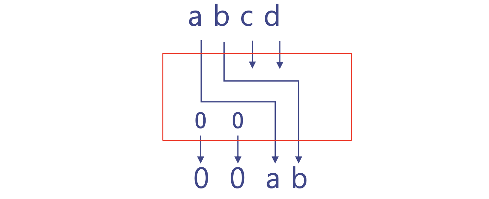
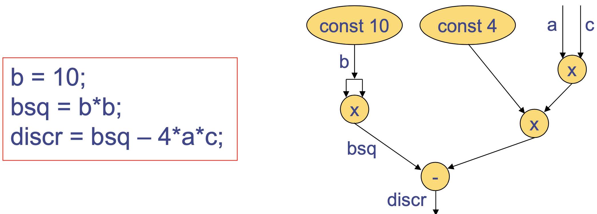

# Bluespec Language Definition

## 1. Basic

### Comment

주석은 C/C++과 동일하게 사용할 수 있다.

### Identifiers

모든 식별자 명명 규칙은 C/C++과 동일하다. 여러 단어로 이름지을 경우 snake case보다는 camel case를 사용한다.

```c
module mkExampleModule();
```

관습적으로 module name은 `mk`로 시작하고, rule name은 `do`로 시작한다. type을 나타내거나 상수인 경우 대문자로 시작하고, 나머지 모든 경우는 소문자로 시작한다.

### Operators

연산자 또한 C/C++에서 사용하는 기본 연산자들을 대부분 그대로 사용할 수 있다. 그러나, 첫 포스트에서도 말했듯이, HDL의 모든 요소는 결국 하드웨어를 나타내는 것이므로, 연산자 또한 하드웨어를 표현하는 요소이다. 예를 들어, 덧셈은 Full Adder, conditional expression은 MUX이다. 아래 그림은 `x >> 2`의 예시이다.


### Keywords

특이한 점은 bluespec의 keyword들이 몇몇 특수한 경우를 제외하고는 대문자를 사용하지 않는다.

### Integer Literals

Verilog와 마찬가지로 bluespec 또한 여러 형태의 literal이 존재한다.

- `'b011'`은 이진수 `011`, 즉 3이다.
- `3'd018'`은 세 자리 십진수 `018`, 즉 18이다. 맨 앞 숫자는 자리수를 나타내는데, 생략 가능하다.
- `b`, `d` 등 진법을 나타내는 글자가 없으면 디폴트는 십진수이다.

### Don't Care

HDL에는 don't care라는 특수한 literal이 존재하는데, 이는 하드웨어의 입장에서 변수의 값을 알 필요가 없다는 뜻이다. 값이 어떤 값이어도 상관 없는 경우 사용하고, `?`로 나타낸다.

```c
Integer x = ?;
```

하드웨어이기에 가능한 표현이고, 값이 결정되어야 하는 곳에 don't care가 사용된다면 컴파일되지 않는다.   모든 type에 사용할 수 있다.

### Begin-end Block

C/C++에서 중괄호로 한 code block을 만드는 것처럼, bluespec에서는 `begin`과 `end`가 그 역할을 대체한다. `module`, `rule`, `case` 등 몇몇 특수한 keyword들은 `begin`-`end`가 아닌, `endmodule`, `endrule` 등의 keyword를 사용한다. 아래 예시를 참고.

```c
// C
void main() {
    int x = 3;
    {
        int y = x + 1;
    }
}

// bluespec
module mkExample();
  Integer x = 3;
  begin
    Integer y = x + 1;
  end
endmodule
```

## 2. Variables

변수는 하드웨어 부품을 나타내는데, `Bit##`같은 primitive type인 경우 단순히 wire이다.

변수, 혹은 배열의 선언과 초기화는 C/C++과 거의 동일하다.

```c
Integer x = 3;
Integer a[20];
Bit##(3) cnt;
a[4] = 1;
cnt[2:0] = 3'b001; // cnt[2] = 0, cnt[1] = 0, cnt[1] = 1
```

배열의 인덱싱을 파이썬처럼 `:`를 이용할 수도 있다. 이 때 특이한 점은 큰 자리가 앞에 온다는 것이다. MSB를 왼쪽, LSB를 오른쪽에 놓는 컨벤션이다.

### Implicit Declaration & Initialization

bluespec은 implicit type을 지원한다. 즉, 변수를 선언과 동시에 초기화할 경우, `let` keyword를 사용해서 변수의 type을 명시하지 않고도 변수를 정의할 수 있다.

```c
let x = 3;
```

### Bit Concatenation & Selection

```c
Bit##(2) a = 2'b01;
Bit##(3) b = 3'b011;

// bit concatenation
let x = {a, b}; // Bit##(5) x = 5'b01101

// bit selection
let y = x[3:2]; // Bit##(2) y = 2'b11
```

### Variable Assignment

`=`를 이용한 variable assignment는 해당 l-value 변수가 나타내는 wire를 r-value에 연결하겠다는 뜻이다. r-value는 단순히 어떤 값일 수도 있고, 복잡한 logic이 될 수도 있다.

## 3. Expression / Statement

Expression과 statement는 아주 간단한 형태의 combinational circuit이다.
아래 그림을 보면 바로 이해가 될 것이다.


### Everything is Static

주의할 점은 HDL 코드는 하드웨어를 기술하는 코드이고, 기본적으로 동시성을 보장한다.
따라서 위의 판별식 circuit이 아래처럼 기술되어도 똑같은 역할을 한다.

```c
Integer b;
Integer bsq;
let disqr = bsq - 4 * a * c;
bsq = b * b;
b = 10;
```

첫 두 줄은 wire를 선언하는 코드이고, 아래 세 줄은 wire끼리 연결하는 코드인데, 어떤 wire를 먼저 연결해도 결과는 똑같을 것이다.

### Conditional Statement

조건문도 C/C++처럼 `if`-`else if`-`else`를 사용한다. 다만, `{}` 대신 `begin`-`end`를 사용한다. 하나의 if-else 페어는 2-to-1 MUX에 해당한다.

```c
// example
Int##(32) x = 0;
if (x == 0) begin
  x = 1;
end
else begin
  x = 0;
end
```

### Loop

반복문도 C/C++처럼 `for`, `while`등을 사용하고, `{}` 대신 `begin`-`end`를 사용한다.

```c
Reg##(Bit##(6)) cnt <- mkRegU(0);
for (Integer i = 0; i < 64; i = i + 1) begin
  if ((i >> 2) & 1) begin
    cnt = cnt + 1;
  end
end
```

### Static Elaboration

그렇다면 for문이 나타내는 하드웨어는 무엇일까?? 놀랍게도 **없다**.
Bluespec 프로그램이 컴파일될 때, 가장 먼저 type checking을 거치고 나서 **Static Elaboration** 단계를 거친다.
이 단계에서는 Integer type이나 for loop 처럼 하드웨어적 의미를 갖지 않는 부분을 제거한다.

```c
// before static elaboration
for (Integer i = 0; i < 3; i = i + 1) begin
  let cs = i + 3;
  c[i] = cs;
end

// after static elaboration
cs0 = 0 + 3;
c[0] = cs0;
cs1 = 1 + 3;
cs[1] = cs1;
cs2 = 2 + 3;
cs[2] = cs2;
```

### Case

Case는 Statement, Expression 두 가지 모두에 사용 가능하다.
C/C++과 거의 유사하나, `begin`-`end`로 block을 구분짓는 것이 아니고, case block의 끝에서 `endcase` 키워드를 이용한다.

```c
// statement
Bit##(2) x;
Bit##(2) notX;
case (x)
  2'b00: notX = 2'b11;
  2'b01: notX = 2'b10;
  2'b10: notX = 2'b01;
  default: notX = 2'b00; // default is optional
endcase

// expression
Bit##(2) x;
Bit##(2) notX = case (x)
  2'b00: 2'b11;
  2'b01: 2'b10;
  2'b10: 2'b01;
  2'b11: 2'b00;
endcase;
```

### Function

Bluespec에서 함수는 단순히 **parameterized combinational logic**이라고 이해하면 쉽다.
함수의 정으를 정규표현식으로 나타내면 다음과 같다(정규표헌식을 봐도 처음엔 이해하기 힘드니 예시 코드를 보자ㅎㅎ). Proviso에 대한 내용은 향후 포스팅에서 다루겠다.

function *type* *identifier* ([*type* *identifier*[, *type* *identifier*]]) [provisos (*proviso*[, *proviso*])] *function body...* endfunction

```c
function Bit##(2) halfAdder(Bit##(1) a, Bit##(1) b)
  s = a ^ b;
  c = a & b;
  return {c, s};
endfunction
```

위 코드는 half adder인데, 두 bit을 받아서 sum과 carry를 계산하는 logic circuit을 그대로 구현하고 있다는 것을 알 수 있다.
